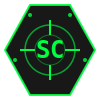
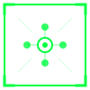

# Sky-Cybernet Logo Files

Quick reference guide for all logo assets and their usage.

---

## 📁 Logo Files

All logo files are located in `/public/` and can be accessed at `https://yourdomain.com/logo-*.svg`

### Icon Logos (100×100px)

| File | Preview | Theme | Use Case |
|------|---------|-------|----------|
| `logo-icon.svg` |  | Green (#00ff41) | Primary app icon, favicon base, profile pictures |
| `logo-icon-orange.svg` |  | Orange (#ff6b35) | Alert theme, alternative branding |
| `logo-minimal.svg` |  | Green | Network/tech contexts, alternative icon |

### Full Logos

| File | Dimensions | Description |
|------|------------|-------------|
| `logo-full.svg` | 400×120px | Icon + Wordmark + Tagline - Complete branding |
| `logo-wordmark.svg` | 350×80px | Text-only variant with decorations |

---

## 🎨 Design Elements

### Icon - Hexagon (`logo-icon.svg`)
```
┌─────────────────────────┐
│     Hexagonal Border    │
│   Targeting Reticle     │
│      "SC" Monogram      │
│    Corner Indicators    │
│     Crosshair System    │
└─────────────────────────┘
```

**Features:**
- Hexagonal tactical border (military aesthetic)
- Dual-ring targeting reticle
- Bold "SC" monogram (Sky-Cybernet)
- 4 animated corner indicators
- Precision crosshair (N/S/E/W)
- Glowing effects

### Minimal - Network (`logo-minimal.svg`)
```
┌─────────────────────────┐
│   Square Border with    │
│   Corner Brackets       │
│   5-Node Network        │
│   (Center + 4 Nodes)    │
│   Connection Lines      │
└─────────────────────────┘
```

**Features:**
- Square tactical border
- Corner bracket accents
- Network topology (hub-and-spoke)
- Satellite nodes (4 directions)
- Connection lines
- Scanning effect accents

### Full Logo (`logo-full.svg`)
```
┌────────────────────────────────────────┐
│  [ICON]   SKY-CYBERNET                 │
│           STRATEGIC NETWORK            │
│           ═══════════════              │
└────────────────────────────────────────┘
```

**Components:**
- Hexagon icon (left)
- Bold wordmark (center-right)
- Tagline subtitle
- Tactical line decorations
- Corner bracket accents

### Wordmark (`logo-wordmark.svg`)
```
┌────────────────────────────────────────┐
│          SKY-CYBERNET                  │
│          STRATEGIC NETWORK             │
│          ─────────────                 │
└────────────────────────────────────────┘
```

**Features:**
- No icon, pure typography
- Glowing text effect
- Decorative tactical elements
- Dot indicators

---

## 💻 Usage Examples

### HTML
```html
<!-- Icon -->


<!-- Full Logo -->

```

### Next.js / React
```tsx
import Image from 'next/image';

<Image 
  src="/logo-icon.svg" 
  alt="Sky-Cybernet"
  width={100}
  height={100}
  priority
/>
```

### CSS
```css
.header-logo {
  background: url('/logo-wordmark.svg') no-repeat center;
  background-size: contain;
  width: 300px;
  height: 80px;
}
```

### Markdown
```markdown

```

---

## 🌈 Color Themes

| Theme | Color | Hex | Use Case |
|-------|-------|-----|----------|
| **Tactical Green** |  | `#00ff41` | Primary brand, success states |
| **Tactical Orange** |  | `#ff6b35` | Alerts, warnings, alt theme |
| **Background** |  | `#000000` | Pure black |
| **Text** |  | `#e5e5e5` | Primary text |

---

## 📐 Size Guidelines

### Minimum Sizes (Don't go smaller)
- **Icon**: 32px × 32px
- **Full Logo**: 120px width
- **Wordmark**: 200px width
- **Favicon**: 16px × 16px

### Recommended Sizes
| Context | Icon Size | Full Logo Width |
|---------|-----------|-----------------|
| Favicon | 32-64px | - |
| Mobile Nav | 40px | - |
| Desktop Nav | 48px | 300px |
| Header | 60-80px | 400px |
| Hero Section | 100-150px | 500-600px |

### Export Sizes (for PNG)
- **Favicon**: 16×16, 32×32, 64×64, 128×128, 256×256
- **App Icons**: 512×512, 1024×1024
- **Social Media**: 1200×630 (Open Graph)
- **Apple Touch**: 180×180

---

## ✅ DO's

- ✅ Use on dark backgrounds (#000 to #1a1a1a)
- ✅ Maintain aspect ratio (no stretching)
- ✅ Use SVG format when possible (scalable)
- ✅ Apply glow effects for enhanced visibility
- ✅ Use CSS variables for theme switching

## ❌ DON'Ts

- ❌ Use on light backgrounds (poor contrast)
- ❌ Distort, skew, or rotate irregularly
- ❌ Change colors outside brand palette
- ❌ Add unauthorizedfilters or effects
- ❌ Use raster formats below 2x resolution

---

## 🚀 Quick Start

### 1. View All Logos
Open `/public/logo-showcase.html` in your browser to see all variants with live previews.

### 2. Use in Components
```tsx
import { Logo } from '@/app/components/Logo';

// Icon variant
<Logo variant="icon" size={48} />

// Full variant with text
<Logo variant="full" size={80} />

// Loading animation
<LoadingLogo size={60} />
```

### 3. Direct File Access
```
/logo-icon.svg          → Hexagon icon (green)
/logo-icon-orange.svg   → Hexagon icon (orange)
/logo-full.svg          → Full branding
/logo-wordmark.svg      → Text only
/logo-minimal.svg       → Network design
```

---

## 📱 Social Media Sizes

Recommended dimensions for social platforms:

| Platform | Size | File to Use |
|----------|------|-------------|
| Twitter/X Profile | 400×400 | `logo-icon.svg` → PNG |
| Facebook Profile | 170×170 | `logo-icon.svg` → PNG |
| LinkedIn | 300×300 | `logo-icon.svg` → PNG |
| Instagram | 320×320 | `logo-icon.svg` → PNG |
| Open Graph | 1200×630 | Create from `logo-full.svg` |
| Twitter Card | 800×418 | Create from `logo-full.svg` |

---

## 🔧 Technical Specs

```yaml
Format: SVG (Scalable Vector Graphics)
Viewbox: 0 0 100 100 (icons) | 0 0 400 120 (full)
Stroke Width: 1.5-2px
Font: Monospace system font
Letter Spacing: 3-5px (tracking-widest)
Effects: drop-shadow, glow
Optimization: Hand-coded, minimal paths
```

---

## 📞 Need Help?

- **Component Documentation**: See `/app/components/Logo.tsx`
- **Brand Guidelines**: See `/BRANDING.md`
- **Full Showcase**: Open `/public/logo-showcase.html`

---

**Last Updated:** March 12, 2026  
**Version:** 1.0.0
